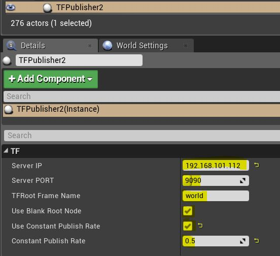

UTFPublisher
====

TF Publisher using:

* [UROSBridge](https://github.com/robcog-iai/UROSBridge) for communication
* [UTags](https://github.com/robcog-iai/UTags) for marking tf tree dependencies on items
* [UCoordConv](https://github.com/robcog-iai/UCoordConv) to convert between ROS and Unreal coordinate systems

Usage
=====

- Add the plugin and its dependencies to your project (e.g `MyProject/Plugins/UTFPublisher`);

- Add `TFPublisher` to your World:

- Fill out the settings on the `TFPublisher` actor:

 * Server IP - IP where the `rosbridge_server` is running
 * Server PORT - PORT where the `rosbridge_server` is running
 * TFRoot Frame Name - The name of the root node (world, map etc.)
 * Use Blank Root Node :
   * TRUE = The root node is in 0,0,0, relative transforms will not be calculated between the root and its immediate children (optimization)
   * FALSE = The root node takes its initial pose where the `TFPublisher` is located
 * Use Constant Publish Rate (seconds) - every tf frame will be published at the same update rate
 * Constant Publish Rate - the delta time (seconds) of the update rate (0.0 seconds means the tf frame will be updated every tick)

- Tag your tf properties on your items (Actors or SceneComponents):

Set your child and parent frame ids as UTags key value pairs;

 If parent frame is missing, tf frame is a directly connected to the tf root node /world /map etc.

Example
=====

* See the [ex-ros-tf-robosim](https://github.com/robcog-iai/RobCoG/tree/ex-ros-tf-robosim) branch of RobCoG as a project example;

### Engine Version 4.19
