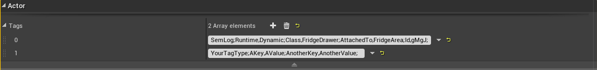
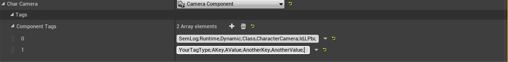

UUtils
======

 * Various helper modules for RobCoG.

 * Supported engine version: **UE 4.25**

Usage
=====

-   Add the plugin to your project (e.g `MyProject/Plugins/UUtils`)  


-   Add the module dependency to your module (Project, Plugin); In the
    `MyModule.Build.cs` file:  

		PublicDependencyModuleNames.AddRange(  
		new string[]
		{
        ...  
        "UMyUtilsModule",  // UIds, UTags etc.
        ...  
		}
		);

-   Include `MyUtilsModule.h` where you plan to use the related functions.

Modules:
=====

## UTags

Using the built in Tag functionalities of Actors and Components to store data in a
key-value pair form. The plugin has various functions to ease the access for such data.

Example of storing key-value pairs:

[`TagType;Key1,Value1;Key2,Value2;Key3,Value3;`]

* first word always represents the `TagType`, this is followed by a `semicolon`
* separate the `[Key]` from the `[Value]` using a `comma`: **,**
* separate the `[Key,Value]`-pairs using a `semicolon`: **;**
* always end the tag description with a `semicolon`: **;**
* do NOT use white spaces in the tag descriptions

How to add tags to an actor:



How to add tags to a component:




### Examples

Tag:

[`SemLog;Runtime,Static;Id,3rFg;Class,Sink;`]

Generating new Ids for all the actors with the `TagType` `SemLog`:

```cpp
	static FReply GenerateNewIds()
	{
		for (TActorIterator<AActor> ActItr(GEditor->GetEditorWorldContext().World()); ActItr; ++ActItr)
		{
			int32 TagIndex = FTagStatics::GetTagTypeIndex(*ActItr, "SemLog");
			if (TagIndex != INDEX_NONE)
			{
				FTagStatics::AddKeyValuePair(
					ActItr->Tags[TagIndex], "Id", FSLStatics::GenerateRandomFString(4));
			}
		}
		return FReply::Handled();
	}
```

Get a map of actors or components to their tag properties giving the world as an input

```cpp
	// Get the map of actors to their tag properties
	const TMap<AActor*, TMap<FString, FString>> ActorToTagProperties =
		FTagStatics::GetActorsToKeyValuePairs(World, "SemLog");

	// Get the map of components to their tag properties
	const TMap<UActorComponent*, TMap<FString, FString>> ComponentToTagProperties =
	FTagStatics::GetComponentsToKeyValuePairs(World, "SemLog");

	// Get all objects with TF tags
	auto ObjToTagData = FTagStatics::GetObjectsToKeyValuePairs(GetWorld(), TEXT("TF"));
```

## UIds

Helper functions for generating and converting universal unique identifiers ([FGuid](http://api.unrealengine.com/INT/API/Runtime/Core/Misc/FGuid/index.html)) to Base64 and back.


## UConversions

Units and coordinate systems conversions from and to Unreal Engine.
