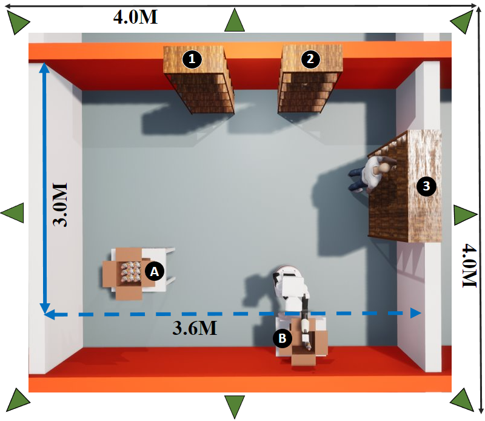

<h1 align="center">
  <br>
  <a href="https://github.com/TheEngineRoom-UniGe">
    
  </a>
  <br>
  Digital Twin For Human Robot Collaboration
  <br>
</h1>

# DT For HRC

This Digital Twin (DT) is developed on Unreal Engine. It replicates a logistic scenario where the robot and the human are supposed to work alongside to prepare an order.

# Requirement

 - Unrea Engine 4.27 + Built from source
 - Visual Studio 2019

# Supported Platform(s)

- Windows x86_64
- Linux x86_64 (though not tested)
# Running The Project

This project assumes that the human operator and the robot are tracked in an X-Y plane using an optical motion capture, although it could be changed by modifying the 'MotionCapture' actor. In the case of utilizing motion capture, the Websocket IP and port of the ROS bridge for the motion capture and the ROS topic should be modified.
'TiagoComm' data asset should be modified also to reflect the IP/PORT of the ros bridge that is broadcasting the robot's joints states.
Human joints states are tracked using a single ZED2 camera. ZED Live link plugin should be installed and enabled.

# N.B 

At the first launch, the virtual environment should be aligned with the reference frame of the motion capture system/ tracking system.

# License

Licensed under MIT [License](LICENSE).

```
Copyright (c) 2022-2023 TheEngineRoom-UniGe, Mohamad Shaaban.
```


